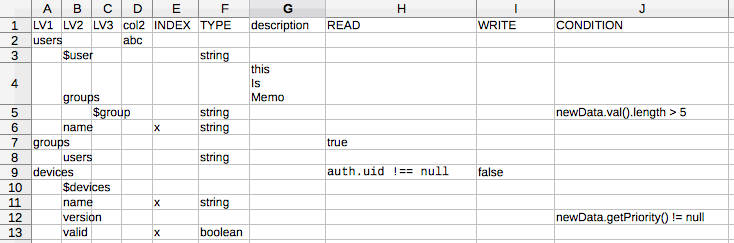

[](https://gemnasium.com/github.com/ottijp/fir-rule-gen)

This is a tool for creating rule configuration for Firebase Realtime Database.
You can design the rule easily by using the spread sheet (like MS Excel), and convert it to Firebase fule format.

## Example

Designing rule with spread sheet like below,



and you can convert it to JSON below.

```
{
  "rules": {
    "users": {
      "$user": {
        ".validate": "newData.isString()"
      },
      "groups": {
        "$group": {
          ".validate": "(newData.isString()) && (newData.val().length > 5)"
        }
      },
      "name": {
        ".validate": "newData.isString()"
      },
      ".indexOn": [
        "name"
      ]
    },
    "groups": {
      ".read": "true"
    },
    "  users": {
      ".validate": "newData.isString()"
    },
    "devices": {
      ".read": "auth.uid !== null",
      ".write": "false",
      "$devices": {},
      "name": {
        ".validate": "newData.isString()"
      },
      ".indexOn": [
        "name",
        "valid"
      ],
      "version": {
        ".validate": "newData.getPriority() != null"
      },
      "valid": {
        ".validate": "newData.isBoolean()"
      }
    }
  }
}
```

## Installation

```
$ npm install -g fir-rule-gen
```

## Usage

* Make CSV file which has columns bellow
    * LV1 - LV32
        * Elements by level
    * INDEX
        * If this element has index (If it will be a condition key) 
    * TYPE
        * The type of this element
        * 'string', 'number', 'boolean'
        * This will be used for '.validate'
    * CONDITION
        * This will be used for '.condition' directly
    * READ
        * This will be used for '.read' directly
    * WRITE
        * This will be used for '.write' directly

* Convert it with command below

```
$ fir-rule-gen <src_csv_path> <dest_json_path>
```

(or you can use it in pile)

```
$ cat <src_csv_path> | fir-rule-gen > <dest_json_path>
```

## License

MIT

